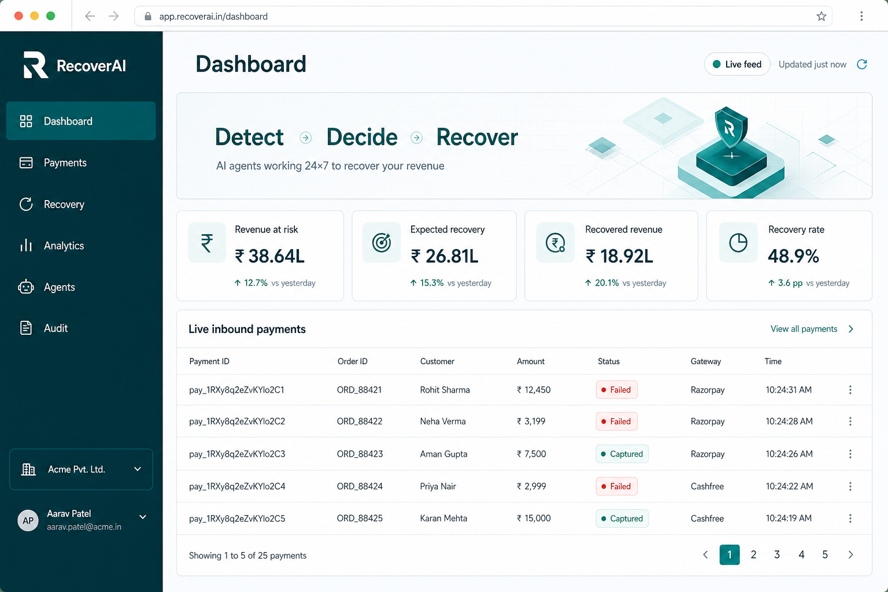
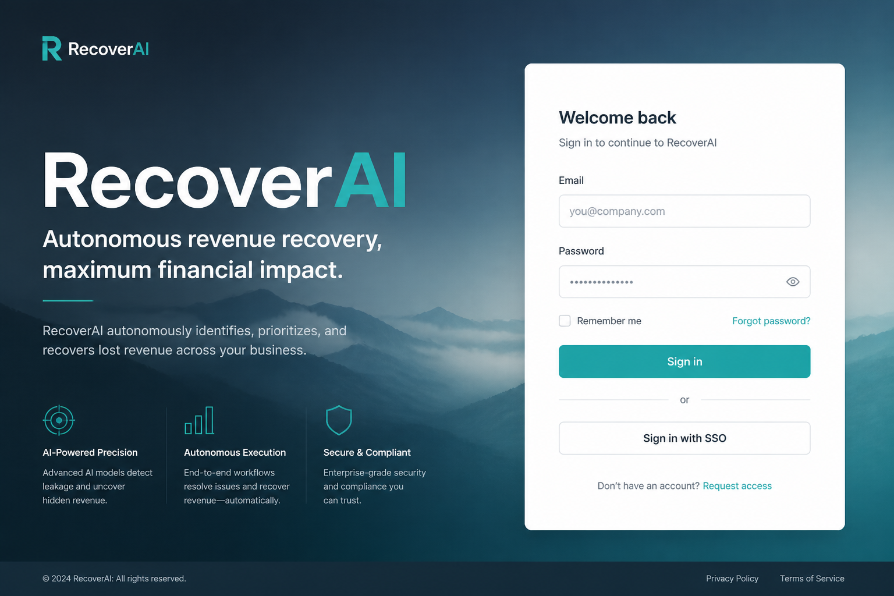
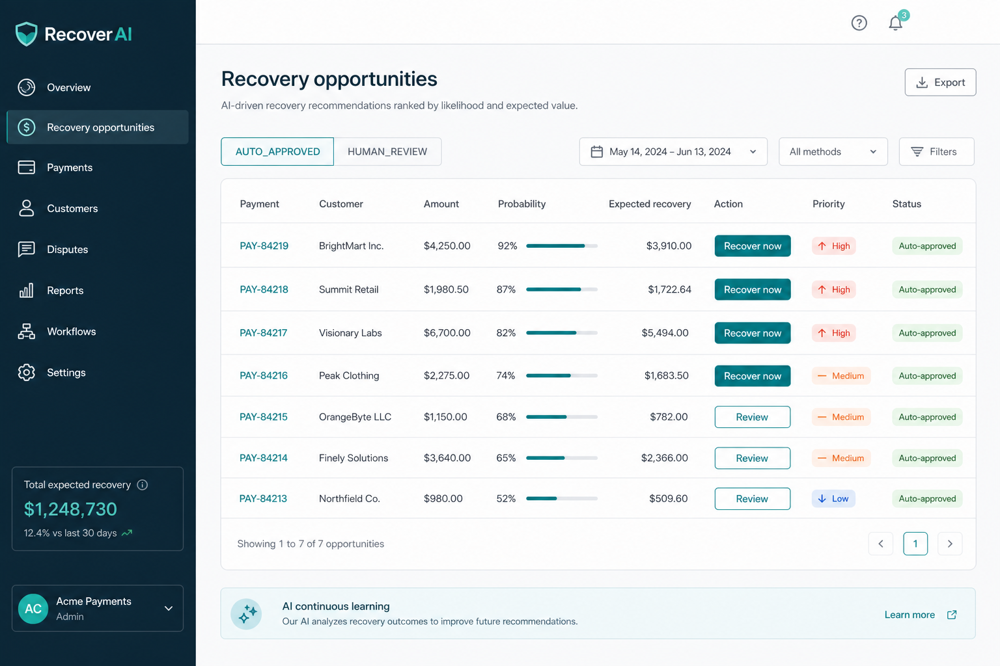

# RecoverAI

**Autonomous revenue recovery for failed payments — predicted, guarded, and audited.**

RecoverAI turns Razorpay payment failures into a prioritized recovery queue: detect → diagnose → predict → rank interventions by expected value → apply deterministic guardrails → approve/execute → verify outcomes → analytics.

<p align="center">
  
</p>

## Product tour

| Sign in | Live dashboard | Recovery queue |
| --- | --- | --- |
|  |  |  |

- **Live webhook feed** — failed Payment Links and `payment.failed` events surface on the dashboard within seconds
- **ML-backed ranking** — recovery probability and intervention expected value from trained local models
- **Hard guardrails** — amount caps, retry limits, confidence thresholds, and human review gates
- **Full audit trail** — every agent decision is recorded for operators and reviewers

## Architecture

```text
Razorpay webhook → idempotent event store → Payment
  → DetectionAgent → DiagnosisAgent → ML prediction / intervention ranking
  → DecisionAgent → GuardrailEngine → approval → ExecutionAgent
  → OutcomeAgent → analytics / audit
```

## Run locally

1. Copy `.env.example` to `.env`, set a strong `SECRET_KEY`, and prefer PostgreSQL (SQLite works as a no-infrastructure fallback).
2. Start the API:

```powershell
cd backend
python -m venv .venv
.\.venv\Scripts\pip install -r requirements.txt
.\.venv\Scripts\uvicorn app.main:app --reload
```

3. Start the UI:

```powershell
cd frontend
npm install
npm run dev
```

4. Register the first administrator with `POST /api/auth/register`, then open [http://localhost:5173](http://localhost:5173).

### Seed data and train models

```powershell
python ml/data_generator.py --rows 100000
python scripts/train_models.py
python scripts/seed.py
cd backend; pytest
```

## Razorpay Test Mode

Use **Test Mode** credentials only:

| Variable | Purpose |
| --- | --- |
| `RAZORPAY_KEY_ID` | Test key id |
| `RAZORPAY_KEY_SECRET` | Test key secret |
| `RAZORPAY_WEBHOOK_SECRET` | Webhook HMAC secret (different from the API secret) |
| `RAZORPAY_MODE` | Must stay `test` |

Configure the webhook URL as:

```text
https://<tunnel-or-host>/api/webhooks/razorpay
```

Subscribe at least to:

- `payment.failed` *(required for Payment Link Failure in test mode)*
- `payment.authorized`
- `payment.captured`
- `payment_link.paid`
- `order.paid`

Signatures are verified over the raw body; duplicates are ignored by payload hash. Razorpay cannot reach `localhost` directly — use a tunnel or deployed HTTPS endpoint.

Local synthetic webhook smoke test:

```powershell
python scripts/test_razorpay_webhook.py
```

## Security and limits

- Passwords are bcrypt-hashed; access is JWT + role gated (`ADMIN`, `ANALYST`, `OPERATOR`, `VIEWER`)
- Auto-recovery capped at ₹10,000, max 2 retries, confidence ≥ 0.35
- Optional LLM explanations never authorize or execute recovery actions
- Secrets stay in `.env` / host environment — never in the browser

## Docker

```powershell
docker compose up --build
```

Starts frontend, backend, PostgreSQL, and Redis. Production should use managed Postgres, a secret manager, HTTPS, migrations, restricted CORS, and a publicly routable signed webhook.

## Render Free plan

**Build command**

```bash
bash scripts/render_build.sh
```

**Start command**

```bash
bash scripts/render_start.sh
```

Set `DATABASE_URL`, `APP_ENV`, `SECRET_KEY`, `CORS_ORIGINS`, and Razorpay Test Mode variables in the Render dashboard. For a one-time demo seed, set `RUN_SYNTHETIC_SEED=true` for a single deploy, then turn it off.

## Limitations

The UI focuses on the operator console. Email/SMS delivery should sit behind a future `NotificationService`, and high volume should move the recovery pipeline to a worker.

## License / status

Internal product codebase. Demo and synthetic records are labelled in the workspace.
